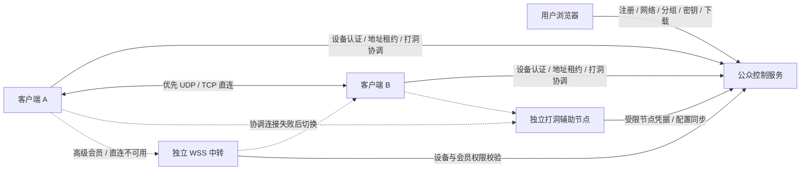

# 架构与边界

## 控制面和数据面

ControlPlane 与 punch 节点的 P2PServerOptions.EnableRelay 固定为 false。
可靠 RelayReliable 消息和数据报转发均被拒绝；修改客户端请求中转也不会生效。
独立 relay 节点只开放 WSS 业务转发，不加载网络 PSK 或组数据密钥。

控制服务为每个网络分配 TCP/UDP 监听端口与独立网络 PSK。
注册消息另外带独立设备凭据；服务端把网络 ID、分组 ID、设备 ID、凭据哈希一起验证。
因此持有某网络 PSK 并不等于可以随意冒用设备或跨组发现。

加入密钥、设备凭据和网络通信密钥是三种不同凭据：

| 凭据 | 用途 | 服务端保存 |
|---|---|---|
| 加入密钥 | 限次数、限有效期地创建设备 | 哈希 |
| 设备凭据 | 获取配置、注册协调、请求中转 | 哈希 |
| 网络 PSK / 组数据密钥 | 建立现有 P2P 传输／加密中转负载 | 受保护数据目录中的网络密钥材料 |

加入密钥吊销只影响之后的加入。已经加入的设备必须单独吊销。
通信密钥轮换后，未吊销设备通过 HTTPS 配置接口更新并重连。

## 会员中转

默认 basic 关闭中转，pro 开启；能力取网络所有者的当前套餐。
控制服务不给普通会员下发 RelayUrls。
relay 节点仍会在 WebSocket 建连时检查设备与会员，随后每 5 秒复查；
控制面查询超时／失败时结束连接，不以旧权限长期继续转发。
服务端按设备限速，并限制节点连接数和单个来源 IP 的连接数。
该限速是运行时流量控制，不是按月计费流量账本。

客户端等待 12 秒给初始打洞机会，再建立后备中转连接。
存在健康直连时，选路跳过中转；直连关闭或发送失败后才能选中中转。
WSS 目录提供同组设备与虚拟地址，UDP 协调完全不可达时高级会员仍可启动网络。
连接中转不意味着所有流量都在中转；待机目录与心跳仍会存在。
目录携带设备进程代次标识，远端重启时重置可靠传输序号；单纯中转重连保留进程代次。

外置中转帧由来源 ID、目标 ID、随机 nonce、AES-GCM tag 和加密 P2P 帧组成。
路由头作为关联数据参与校验；中转节点将来源 ID 绑定到已认证设备，只允许同组转发。
组内成员共享组数据密钥，当前模型将同组受邀设备视为可信网络成员。
它不是每台设备独立公钥的 ZeroTier 协议，也不兼容 ZeroTier 客户端。

## 备用打洞

客户端按配置中的协调地址列表，在连接失败后选择下一项，单次连接尝试限时 15 秒。
punch 节点每 3 秒同步网络与设备快照，使用同样的固定租约；快照超过 30 秒失效。
已有注册约每 5 秒重新验证，避免在控制面长期不可达时无限延续旧授权。

当前各协调节点独立维护在线对端表，没有跨协调节点实时联邦。
主节点整体故障时，设备重试到备用节点后重新发现彼此。
在部分设备能访问主节点、其他设备只能访问备用节点的分裂场景下：
普通会员的跨节点发现尚不保证；高级会员可以通过共同的独立中转节点连接。
真实多地域服务后续应增加共享在线注册表、协调节点选主或跨节点信令。
因此本版按“一个主协调 + 故障备用”部署，不按活跃多主部署。

## 数据与规模

当前 JSON 存储适合单控制实例的首版。写操作在进程锁内读取、修改并原子替换文件；
异常请求不保存状态，不会消费加入次数或留下半个设备。
数据损坏使启动失败，不会静默清空账号。
Linux 数据目录权限为 0700，状态文件为 0600；Windows 部署需限制目录 ACL。

默认 100 个网络端口，每网络最多 512 条传输连接，每会话最多 256 个对端。
套餐设备数可以比传输限制更小。平台端口容量与套餐数量限制是不同维度。
客户端支持最多两个中转地址，同时连接，避免设备分别选不同中转节点而互相不可见。
