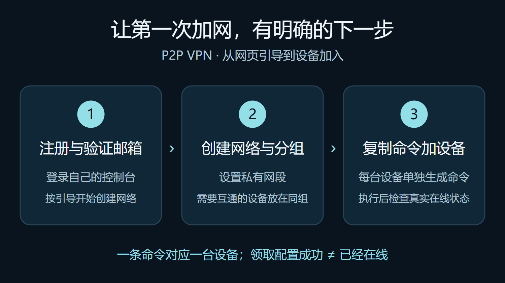
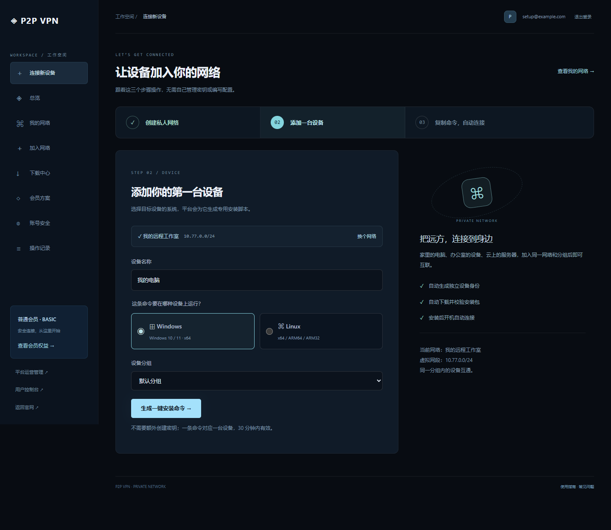
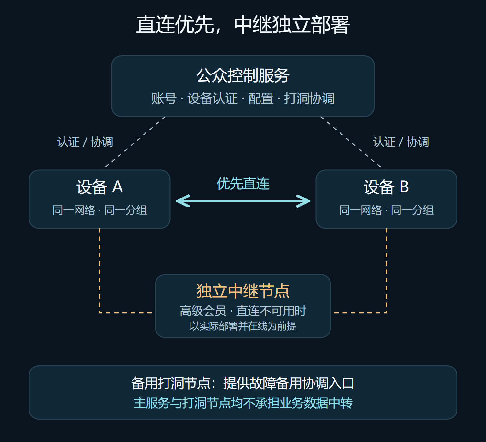

# 我把异地组网，做成了「复制一条命令」

家里放着一台 NAS，办公室有一台电脑，现场还有几台 Linux 设备。它们各自能上网，但想让它们互相访问，往往还得折腾公网地址、端口映射、密钥和客户端配置。

我希望把这件事做得简单一些：**先在网页里建好自己的网络，再给每台设备复制一条安装命令。**

于是，我把原项目里的 VPN 能力单独拆了出来，做成了现在的 **P2P VPN**。它包含公众网站、用户控制台、独立客户端，以及可以分开部署的打洞和中继节点。

这篇文章，带你看看它现在能做什么，以及我为什么这样设计。

## 01｜从注册到加网，按引导走就行

第一步，**注册账号并验证邮箱**。登录后进入自己的管理界面，平台会引导你创建第一个网络。

第二步，**给网络起个名字，设置网段和分组**。例如，把工作设备放进“远程工作室”，按实际需要选择私有网段。网段要避开设备所在的局域网和其他 VPN 网段，减少路由冲突。

这里的分组不是单纯的标签：同一网络里的不同分组是通信隔离域。需要互通的设备，应加入同一个分组。

第三步，**选择设备系统，生成专属安装命令**。复制到目标机器执行，脚本会下载对应客户端、校验安装包、领取设备配置并安装服务。主流程不用再手动找密钥、下载 JSON，再把配置搬来搬去。

*上图是实际项目界面，使用本地演示账号和演示网络，不包含真实用户资料或安装凭据。*

一条命令对应一台设备，当前有效期为 30 分钟。下载中断后可以在同一台机器上重试；如果命令过期，回控制台重新生成即可。

配置领取成功和设备在线是两个状态。**只有客户端真正建立协调连接或上报有效在线状态，控制台才会显示在线。** 添加第二台同组设备后，再验证实际互通。

## 02｜优先直连，主服务不承担数据中转

这套系统里，我把账号管理和设备间的数据传输分开了。

公众控制服务负责注册、网络与分组管理、设备认证、配置下发和打洞协调。设备先尝试建立直连，业务数据在可用的直连链路上传输。

**主服务不承担业务数据中转。** 普通会员使用认证和打洞能力；高级会员在直连不可用时，可以使用独立中继作为备用路径。

这里有一个前提：管理员必须实际部署中继节点，并让它正常上线。开通高级会员，不会凭空变出一台可用的中继服务器。

备用打洞节点也可以独立部署。它提供协调入口的故障备用，与负责转发数据的中继节点是不同角色。

这种使用流程借鉴了常见的虚拟组网产品，但它使用自己的实现，**不兼容 ZeroTier 客户端，也不承诺所有 NAT 环境都能打洞成功**。

## 03｜Linux 安装，已经不需要 Python

这次我专门整理了一遍安装过程。

现在官网生成的是 **sh 安装脚本**，不再依赖 Python 或 jq。下载地址和 SHA-256 由平台直接写进脚本，配置交给原生客户端解析。

用户不需要手动判断下载哪个 Linux 包：脚本会结合 CPU 架构和用户空间位数，选择 x64、ARM64 或 ARM32（ARMv7）版本。

这些 Linux 客户端采用静态 musl NativeAOT 构建，不需要目标机器预装 .NET 运行时，也不依赖宿主 glibc。Windows 则提供对应的客户端和管理员 PowerShell 安装流程。

为了让失败原因更清楚，脚本还会：

- 在领取设备身份前检查安装空间和 inode。
- 下载后校验 SHA-256，并试运行客户端。
- 为同机重试保留领取标识，避免重复创建设备。
- 检测已有设备配置，拒绝直接覆盖另一个设备身份。
- 安装成功后清理大体积下载缓存。

当然，Shell 脚本仍要调用系统工具。Linux 一键安装需要 curl、unzip 或 BusyBox、基础命令，以及 systemd、iproute2 和可用的 TUN；精简系统需要先满足这些条件。

目前 Linux x86 32 位和 ARMv6 暂不支持，**ARM32 不等于 x86 32 位**。

## 04｜用户有自己的空间，管理员也有后台

对普通用户来说，主要工作是管理自己的网络、分组、设备和安装命令。

对平台管理员来说，后台可以查看用户及设备状态，设置会员等级和到期时间，管理独立节点，并配置 SMTP 发信服务和通知收件邮箱。注册启用邮箱验证，未配置可用发信服务时，不会绕过验证开放注册。

设备有独立认证凭据，用户只能管理自己名下的资源。安装包校验、权限检查、凭据撤销和网络密钥轮换，都应该成为日常流程的一部分。

不过，我不会把它描述成“绝对安全”或“平台完全无法接触密钥”。平台保存受保护的网络密钥材料，同组设备也是当前信任边界的一部分；管理员仍然需要做好服务器、账号和备份的保护。

## 05｜现在可以用，也把边界说清楚

我已经验证了注册引导、安装命令生成，以及 x64、ARM64 的实际下载、配置领取和同机重试。客户端的直连与独立中继路径也有对应的集成测试。

但具体到你家里的路由器、公司的防火墙和现场设备，仍需要做实际互通测试。当前一个客户端实例一次加入一个网络分组；Android 客户端还没有迁移到这个独立项目。

服务端目前采用单实例 JSON 存储，备用协调节点之间也没有实时的跨节点发现能力。会员可以由管理员开通，暂时没有接入自动支付、订单和退款系统。

我更希望先把“注册、建网、加设备、看状态”这条路径做顺，再根据真实使用场景继续完善。

如果你也有分散在不同地方的电脑、NAS 或 Linux 设备，可以从两台设备开始试起来：**建一个网络，放进同一个分组，各复制一次安装命令，再检查它们是否真正互通。**

**体验网站：** [vpn.hngs.pub](https://vpn.hngs.pub)

**源码仓库：** [github.com/hnlyf168/p2pvpn](https://github.com/hnlyf168/p2pvpn)

如果遇到问题，可以在仓库里描述系统版本、CPU 架构、网络环境和错误信息。安装命令、设备配置、密钥和邮箱授权码请不要贴到公开讨论区。
